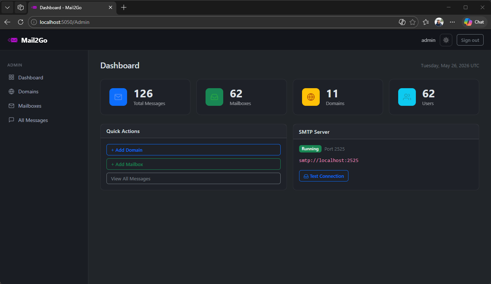
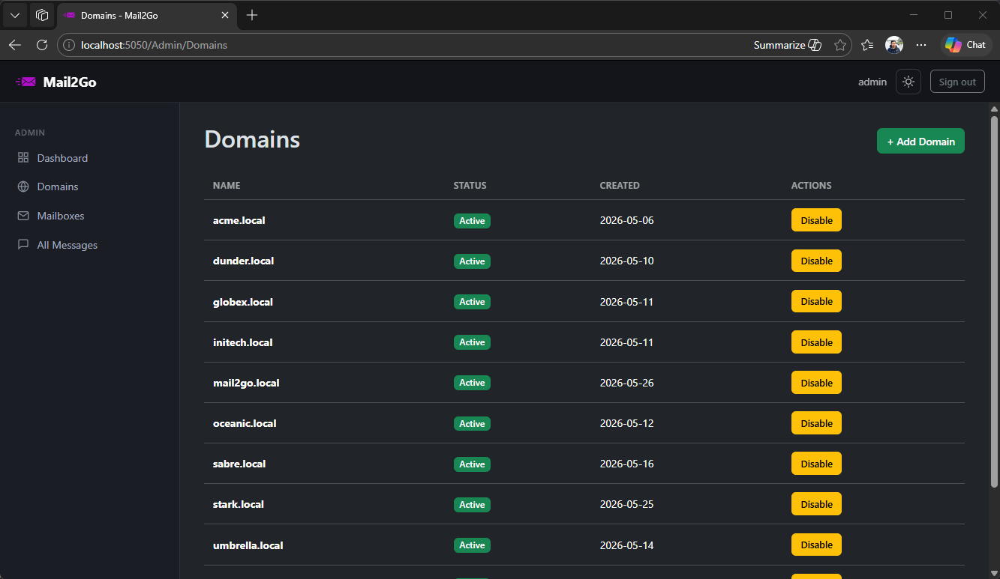
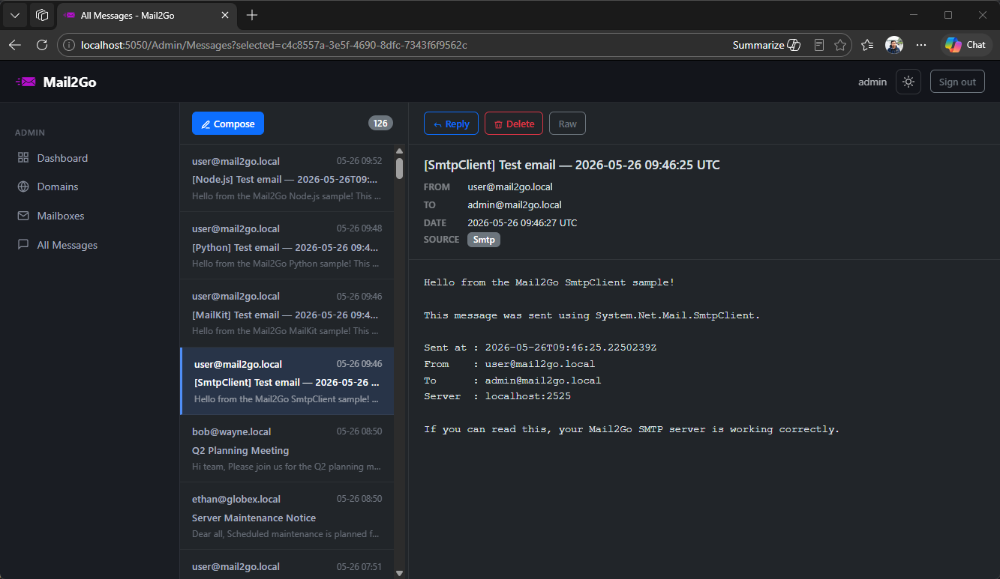

# Mail2Go

**A lightweight, self-hosted SMTP capture server for developers and QA teams.**

Mail2Go intercepts emails sent by your application, stores them locally, and lets you inspect them through a clean web UI — no email ever reaches the internet.







## Why Mail2Go?

Testing email workflows in development is painful. Production SMTP servers are slow, noisy, and risky. Mail2Go gives you a local SMTP server that captures every message your app sends, organizes them by domain and mailbox, and presents them in a web interface — all without any external dependencies.


## Features

- **SMTP capture** — Receives messages on port 2525. No relay, no external delivery.
- **SMTP AUTH** — Login-based authentication using the same user accounts as the web UI.
- **Domain management** — Create and manage multiple test email domains.
- **Mailbox per user** — Each user has a dedicated mailbox address.
- **Web-based inbox** — Read, compose, and delete messages from the browser.
- **Compose & reply** — Write test emails directly from the UI.
- **Admin & User roles** — Admins manage everything; users see only their own mailbox.
- **Dark / Light theme** — Toggle between dark and light mode.
- **Clean Architecture** — .NET 10, ASP.NET Core MVC, EF Core, SQLite.
- **Fully tested** — xUnit unit tests and integration tests included.


## Quick Start

### Prerequisites

- [.NET 10 SDK](https://dotnet.microsoft.com/download)

### Run

```bash
git clone https://github.com/agusk/mail2go.git
cd mail2go
dotnet run --project src/Mail2Go.Web
```

Open **http://localhost:5050** and log in with:

| Account | Username | Password |
|---|---|---|
| Admin | `admin` | `pass123` |
| User | `user` | `pass123` |

> Change the default passwords after first login.

### Point Your App at Mail2Go

```
SMTP Host : localhost
SMTP Port : 2525
Username  : user@mail2go.local
Password  : pass123
TLS       : none
```

### Run with Docker

```bash
docker compose up --build
```

Web UI → **http://localhost:5050** · SMTP → **localhost:2525**

Data is persisted in a Docker named volume (`mail2go_data`). The database and seed accounts are created automatically on first startup — no manual migration needed.


## Documentation

| Document | Description |
|---|---|
| [Getting Started](docs/GETTING_STARTED.md) | Installation, configuration, SMTP client examples |
| [User Manual](docs/USER_MANUAL.md) | How to use the web UI (Admin & User) |
| [Technical Reference](docs/TECHNICAL.md) | Architecture, data model, flows, configuration |


## Project Structure

```
mail2go/
├── src/
│   ├── Mail2Go.Domain/           # Entities and domain rules
│   ├── Mail2Go.Application/      # Use cases, interfaces, commands
│   ├── Mail2Go.Infrastructure/   # EF Core, SQLite, SMTP server
│   └── Mail2Go.Web/              # ASP.NET Core MVC, Razor views
├── tests/
│   ├── Mail2Go.UnitTests/        # xUnit unit tests (NSubstitute + Shouldly)
│   └── Mail2Go.IntegrationTests/ # WebApplicationFactory + MailKit tests
├── docs/
│   ├── GETTING_STARTED.md
│   ├── USER_MANUAL.md
│   └── TECHNICAL.md
├── Dockerfile                    # Alpine multi-stage build
├── docker-compose.yml            # Compose with persistent volume
└── .dockerignore
```


## Running Tests

```bash
# Unit tests
dotnet test tests/Mail2Go.UnitTests/

# Integration tests
dotnet test tests/Mail2Go.IntegrationTests/
```


## Tech Stack

| Layer | Technology |
|---|---|
| Framework | ASP.NET Core 10 MVC |
| Database | SQLite via EF Core 10 |
| SMTP Engine | SmtpServer 11.x |
| Identity | ASP.NET Core Identity |
| UI | Bootstrap 5 (dark/light) |
| Container | Docker (Alpine) · Docker Compose |
| Tests | xUnit · NSubstitute · Shouldly |

