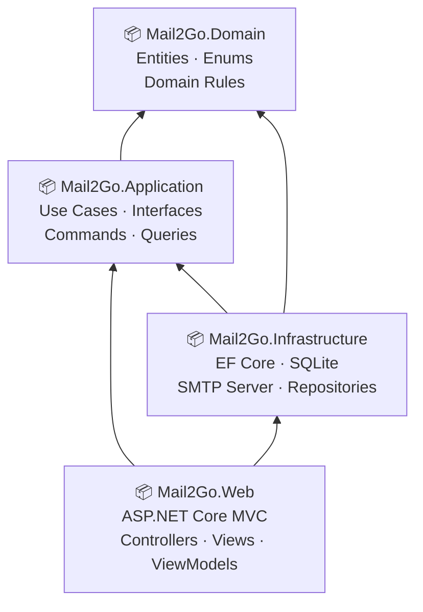
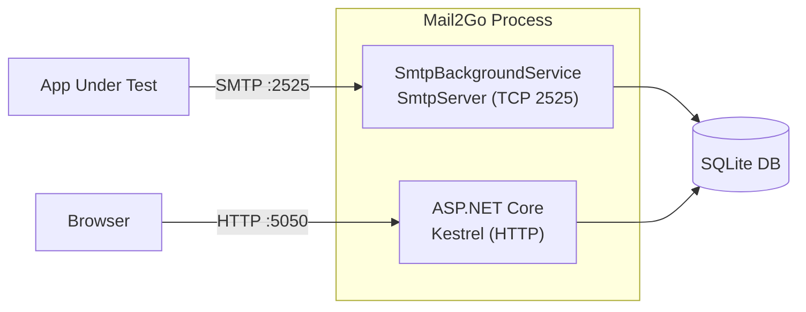
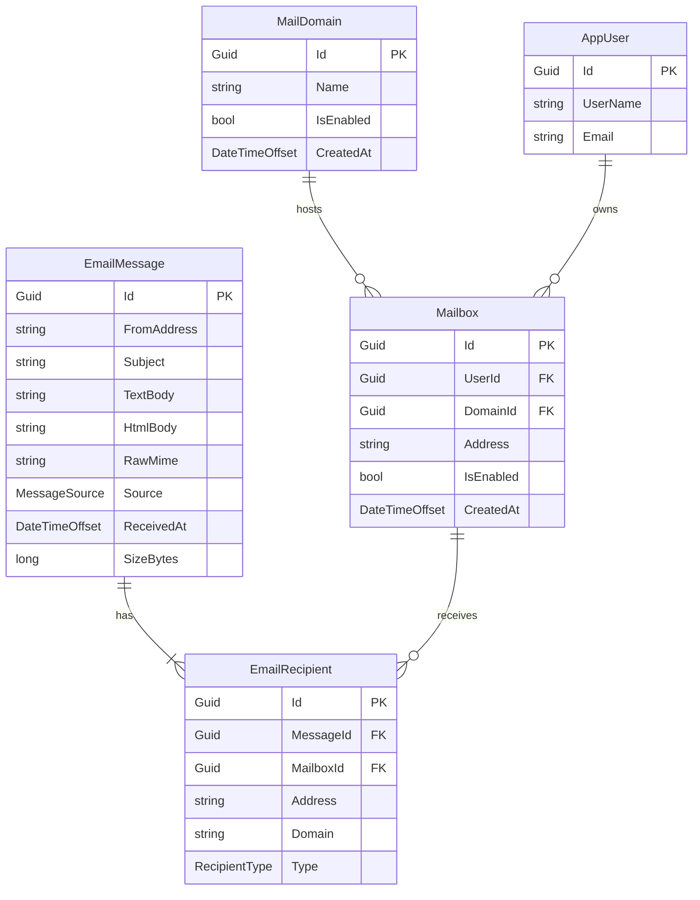
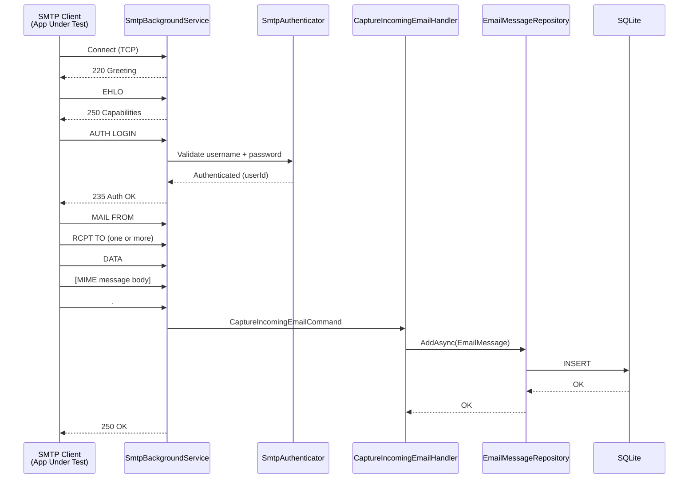
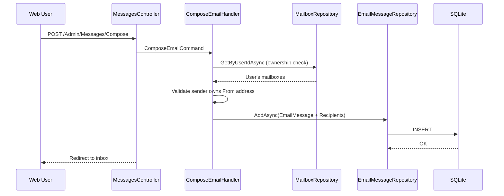
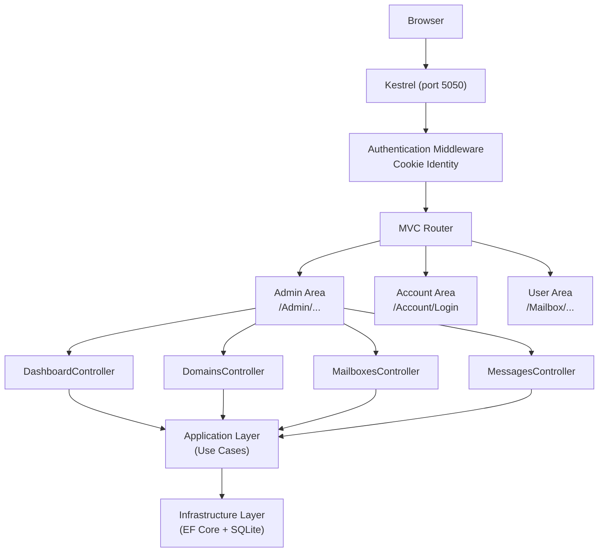

# Mail2Go — Technical Reference

> Version 0.1.0 · ASP.NET Core 10 · SQLite · Clean Architecture


## 1. What Is Mail2Go

Mail2Go is a **self-hosted SMTP capture server** designed for development, QA, and integration testing.

Instead of sending emails to real recipients, applications under test point their SMTP configuration to Mail2Go. Every message is intercepted, stored, and made available through a web UI. No email ever leaves the machine.

### Key Characteristics

| Property | Value |
|---|---|
| Framework | ASP.NET Core 10 MVC |
| Database | SQLite (via EF Core) |
| SMTP Engine | SmtpServer 11.x |
| Architecture | Clean Architecture (4-layer) |
| Authentication | ASP.NET Core Identity |
| Default SMTP Port | 2525 |
| Default Web Port | 5050 |
| License | MIT |


## 2. Architecture Overview

Mail2Go uses **Clean Architecture** with a strict inward dependency rule:



### Layer Responsibilities

| Layer | Responsibility |
|---|---|
| **Domain** | Core entities (`EmailMessage`, `Mailbox`, `MailDomain`), enums, domain rules. Zero external dependencies. |
| **Application** | Use cases (commands & queries), repository interfaces, service abstractions. Depends only on Domain. |
| **Infrastructure** | EF Core `DbContext`, SQLite, repository implementations, SMTP background service, MIME parsing, seed data. |
| **Web** | ASP.NET Core MVC controllers, Razor views, view models, authentication pages, DI wiring, startup. |


## 3. Core Components

### 3.1 SMTP Background Service

The SMTP server runs as a **hosted background service** (`IHostedService`) alongside the web app in the same process.



- Binds to `0.0.0.0:2525` by default (configurable).
- Handles `EHLO`, `AUTH LOGIN`, `AUTH PLAIN`, `MAIL FROM`, `RCPT TO`, `DATA`.
- On `DATA` completion, invokes `CaptureIncomingEmailHandler` to persist the message.

### 3.2 Authentication

Web authentication uses **ASP.NET Core Identity** with cookie-based sessions.

- Users log in with **username or email** + password.
- Two roles: `Admin` and `User`.
- SMTP AUTH credentials are the same as web login credentials.

### 3.3 Domain & Mailbox Model




## 4. Email Capture Flow (SMTP Incoming)

When an SMTP client sends a message, Mail2Go intercepts it end-to-end:




## 5. Compose Email Flow (Web-Based)

Composed emails are stored locally — no external delivery occurs in v0.1.0.



> **Admin bypass**: Admins can set `SkipMailboxOwnerCheck = true` to compose from any managed mailbox (e.g. for seeding test data).


## 6. Web Request Flow




## 7. Authorization Matrix

| Feature | Admin | User |
|---|:---:|:---:|
| Dashboard | ✅ | ❌ |
| Domain Management | ✅ | ❌ |
| User Management | ✅ | ❌ |
| Mailbox Management | ✅ | ❌ |
| View All Messages | ✅ | ❌ |
| View Own Mailbox | ✅ | ✅ |
| Compose Email | ✅ | ✅ |
| Delete Any Message | ✅ | ❌ |
| Delete Own Message | ✅ | ✅ |
| SMTP Test Connection | ✅ | ❌ |


## 8. SMTP Configuration

Mail2Go's SMTP server is configured via `appsettings.json`:

```json
{
  "Smtp": {
    "Host": "0.0.0.0",
    "Port": 2525,
    "EnableTls": false,
    "RequireAuthentication": true,
    "AllowAnonymous": false,
    "MaxMessageSizeBytes": 10485760
  }
}
```

| Key | Default | Description |
|---|---|---|
| `Host` | `0.0.0.0` | Bind address. Use `127.0.0.1` for localhost only. |
| `Port` | `2525` | TCP port. Use a high port to avoid root privileges. |
| `EnableTls` | `false` | STARTTLS support (deferred). |
| `RequireAuthentication` | `true` | Force `AUTH` before `MAIL FROM`. |
| `AllowAnonymous` | `false` | Allow unauthenticated SMTP sessions. |
| `MaxMessageSizeBytes` | `10485760` | 10 MB max message size. |


## 9. Data Storage

Mail2Go uses **SQLite** stored as a single file:

```
data/mail2go.db
```

The `data/` directory is created on first run. EF Core applies migrations automatically at startup.

### Key Tables

| Table | Purpose |
|---|---|
| `MailDomains` | Registered test domains |
| `Mailboxes` | Email addresses mapped to users |
| `EmailMessages` | All captured/composed messages |
| `EmailRecipients` | Per-message recipient entries |
| `AspNetUsers` | Identity users (AppUser) |
| `AspNetRoles` | Roles (Admin, User) |
| `AspNetUserRoles` | User ↔ Role mapping |


## 10. Technology Stack

| Component | Technology |
|---|---|
| Web Framework | ASP.NET Core 10 MVC |
| UI | Bootstrap 5, dark/light theme |
| ORM | Entity Framework Core 10 |
| Database | SQLite |
| SMTP Engine | SmtpServer 11.x |
| MIME Parsing | MimeKit 4.x |
| Identity | ASP.NET Core Identity |
| Unit Tests | xUnit 2.9 + NSubstitute + Shouldly |
| Integration Tests | xUnit + WebApplicationFactory + MailKit |
| Target Runtime | .NET 10 |


## 11. Non-Goals (v0.1.0)

The following are explicitly **out of scope** for the current version:

- Real external email delivery
- SMTP relay to public mail servers
- IMAP / POP3 support
- Attachment rendering / download
- Message search
- DKIM / SPF / DMARC validation
- PostgreSQL support
- High-availability deployment
- Multi-tenancy
- REST API

These are tracked as deferred features for future versions.
